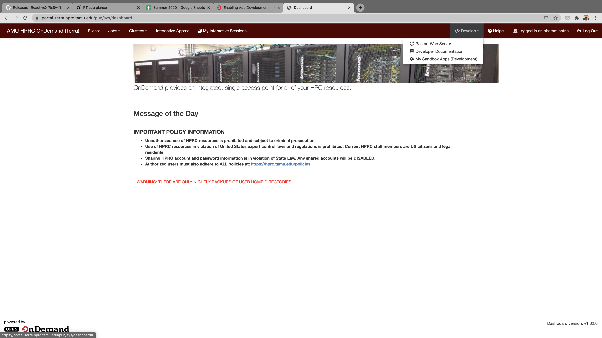
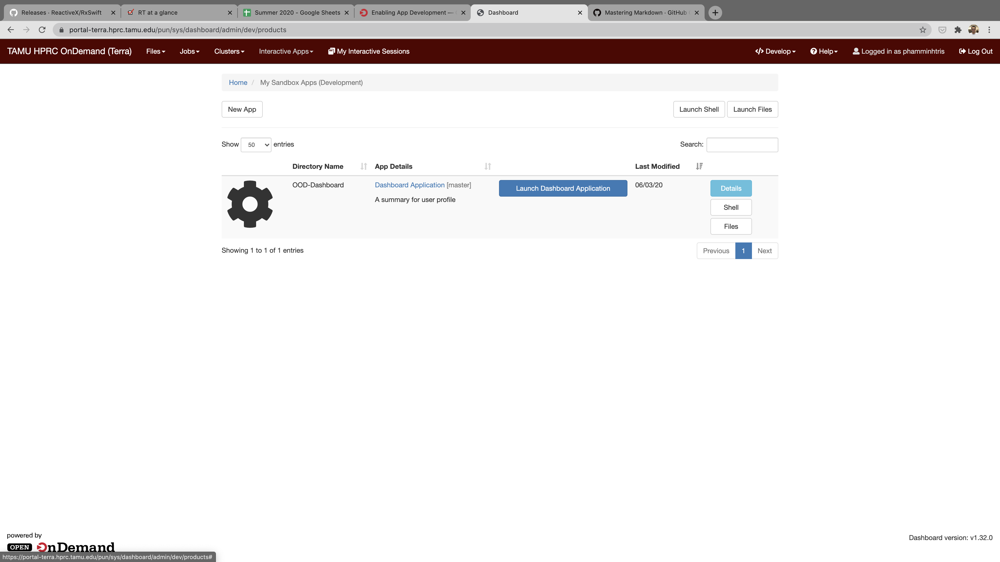
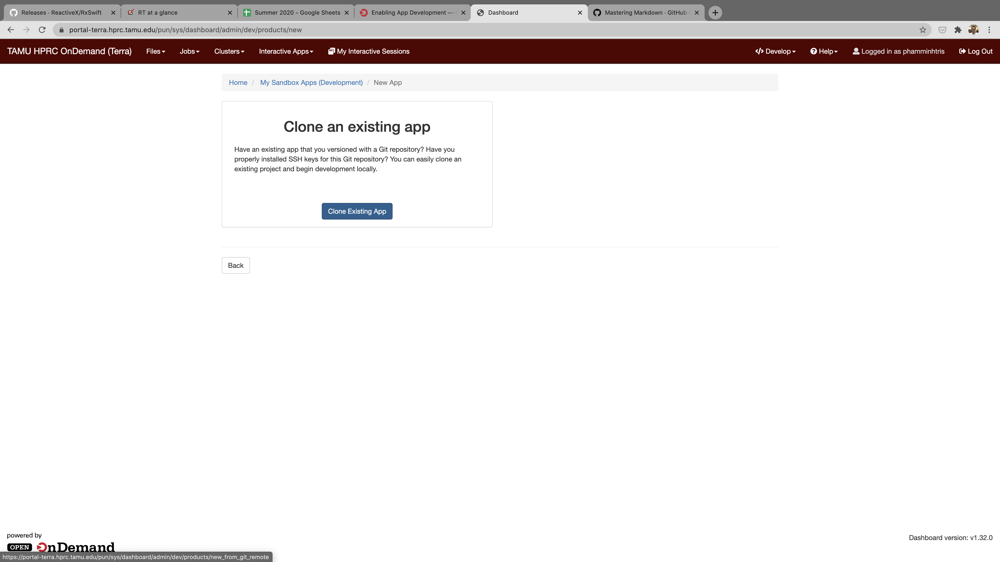
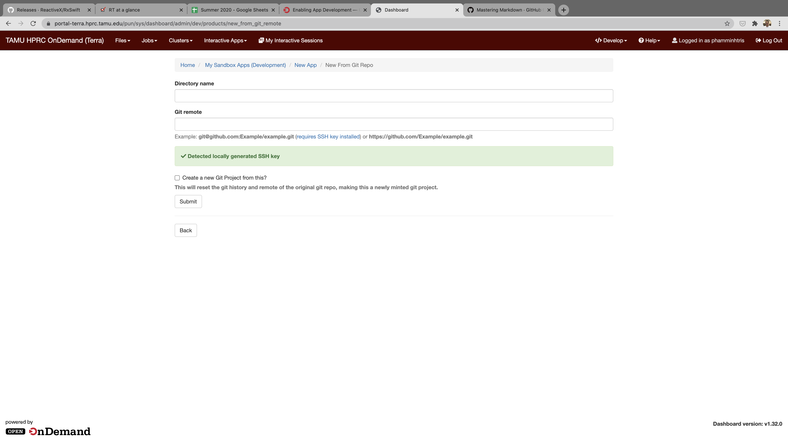
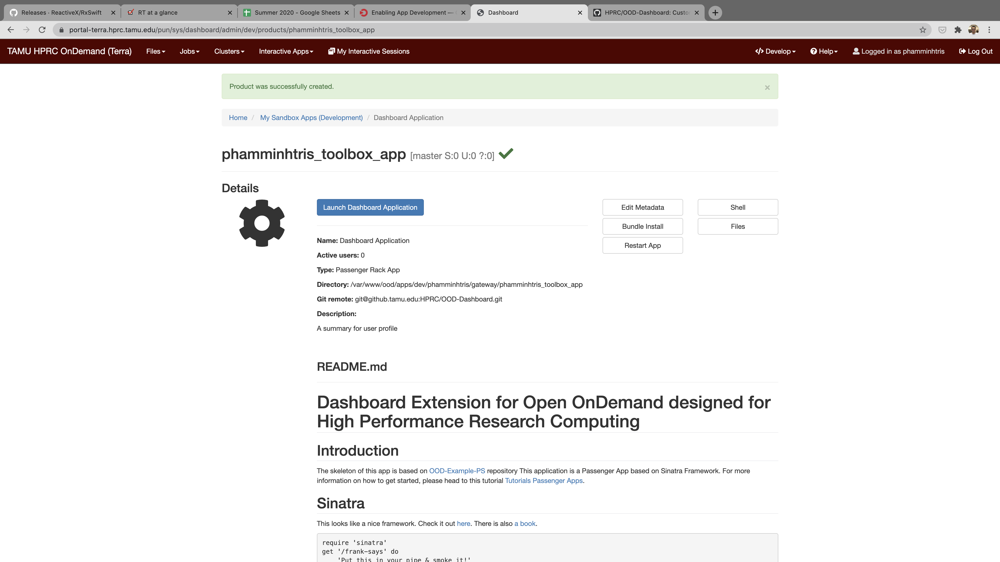
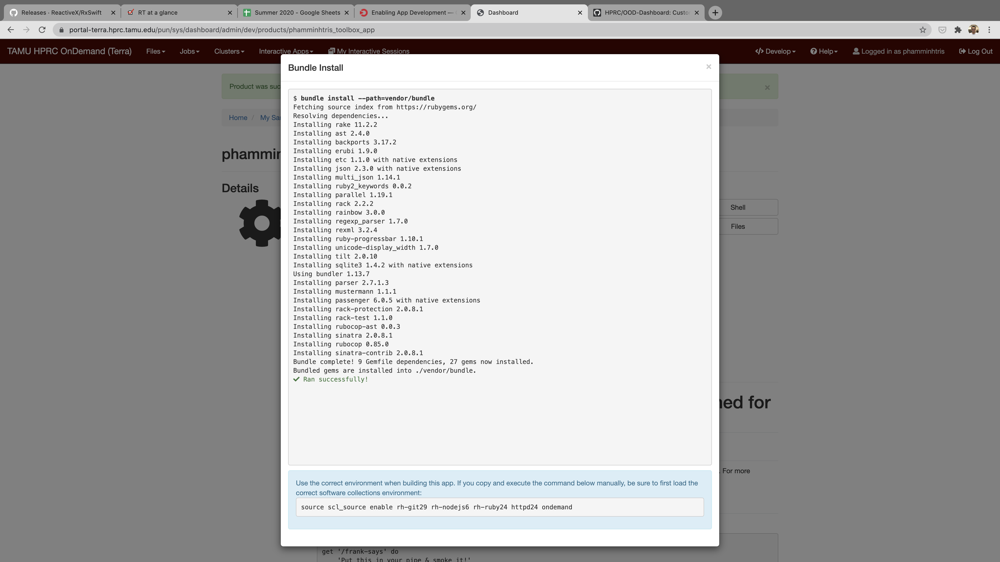
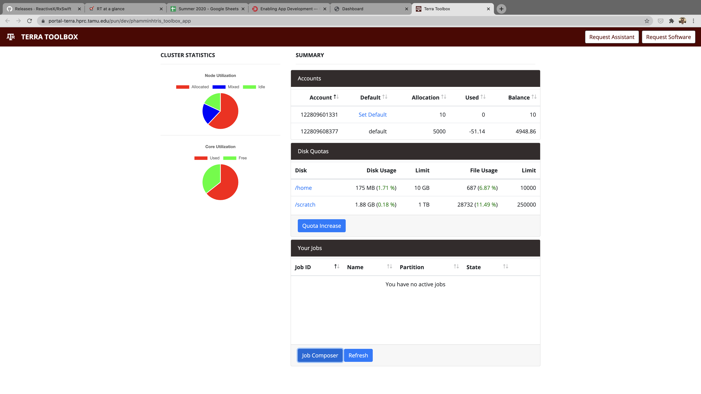

# Instructions to install the toolbox application

## 1. Enable development within OOD

To install the application in OOD sanbox enviroment, you will first need to enable Developer menu for your account. The original instructions can be located in this [link](https://osc.github.io/ood-documentation/master/app-development/enabling-development-mode.html#enable-in-ondemand-v1-6).

For Terra cluster, the portal's hostname is portal-terra.hprc.tamu.edu. You will need to login into the portal node to enable the developer menu. To enable the developer menu, for our setup on Terra, we can simply create the correct directory structure using the following command:

```bash
$ mkdir -p /var/www/ood/apps/dev/[username]/gateway
```

Note: There is additional steps listed in the original OOD instructions but I found it works just fine **without** the below steps:

```bash
$ cd /var/www/ood/apps/dev/[username]
$ sudo ln -s /home/[usernam]/ondemand/dev gateway
```

## 2. Clone a new application

Now login to Terra Portal using this url [https://portal-terra.hprc.tamu.edu/pun/sys/dashboard](https://portal-terra.hprc.tamu.edu/pun/sys/dashboard). If done correctly, you should have access to developer menu at this point



Within **Develop menu** go to **My Sandbox Apps (Developments)**



In **My Sandbox Apps** page, click on **New App**. 



Click on **Clone Existing App**



Enter:

**Directory name**: for this field, I would suggest that you enter the directory name following this pattern

```
[username]_toolbox_app
```

The user name prefix will avoid conflict among copies of this app deployed within the same OOD instance.

**Git remote**: git@github.tamu.edu:HPRC/OOD-Dashboard.git

This is our github repository for this project.

**Create a new Git Project from this?**: Make sure you **uncheck** box so that you can easiy pull new code when it is available.



**⚠️ Important Steps:**

In the app detail page (see the image above), click **Bundle Install**. This step will install necessary dependencies that this app uses. Wait for "Bundle Install" to complete. You should see something similar to the image shown below:



Back to your terminal (assume you are still in logged in), go to the newly cloned app directory

```bash
$ cd /var/www/ood/apps/dev/[username]/gateway/[your app directory]
```

Note: [your app directory] is the directory name you gave in Clone Existing App page.

Using your favorite text editor (vim, nano, etc. ), open config.yml. 
Please replace the following configuration parameters (by changing [cluster name], [your app directory name], [username], request email, help_email) according to your setup.

The other parameters can be left intact. 

```yaml
development: &common_settings
    cluster_name: '[cluster name]' # this will dynamically change the name of the current cluster
    dashboard_url: '/pun/dev/[app name]' # this is the URL that point to this app. (help to configure JavaScript code correctly)
    request_email: 'user@exxample.edu' # this is where all the requests submitted by the user will be sent to
    help_email: 'user@example.edu' # this is where all the HELP requests submitted by the user will be sent to
    driver_scripts_path: '/var/www/ood/apps/dev/[username]/gateway/[app name]/machine_driver_scripts' # this is the path to the machine driver scripts
```

An example is given here:
```yaml
development: &common_settings
    cluster_name: 'Terra'
    dashboard_url: '/pun/dev/OOD-Dashboard'
    request_email: 'johndoe@tamu.edu'
    help_email: 'johndoe@tamu.edu'
    driver_scripts_path: '/var/www/ood/apps/dev/johndoe/gateway/OOD-Dashboard/machine_driver_scripts'
```

Back to App Detail Page


Click on Launch Dashboard Application. In the next page, you will be asked to initialize your app for the first launch (click on red button). 

After evething went well, you will see the main dashboard

