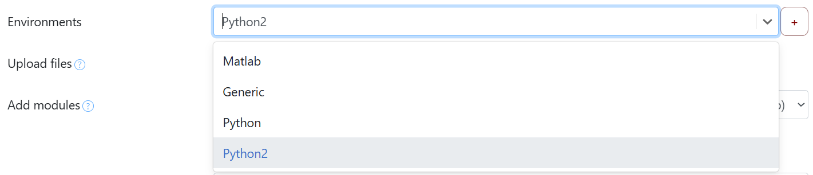

# User Workflows

User workflows are custom Drona Workflow Engine (DWE) workflows stored in your personal workspace. They provide complete isolation from system-wide workflows while following the same architecture, allowing you to create, customize, and experiment with workflows without requiring system-level permissions.



## What are User Workflows?

User workflows are self-contained workflow definitions stored in your personal directory that follow the same structure as system workflows. Each user workflow represents a complete computational environment tailored to your specific research needs, enabling experimental development, custom modifications, and specialized computational frameworks.

User workflows appear with **blue highlighting** in the workflow selection dropdown, making them easily distinguishable from system-provided workflows.

## Workflow Storage

User workflows are stored under the `environments/` subdirectory of your configured DWE directory. The DWE directory is set by `drona_dir` in your user configuration file:

```
~/.drona/config.json
```

For example, if your `config.json` contains:

```json
{ "drona_dir": "/scratch/user/<username>/drona_wfe" }
```

Then your user workflows are stored at:

```
/scratch/user/<username>/drona_wfe/environments/
```

The `environments/` subdirectory is created automatically the first time DWE loads if it does not already exist.

## Workflow Structure

Any directory placed inside your `environments/` directory is treated as a user workflow. The directory must contain the following core files to function correctly:

| File | Required | Description |
|---|---|---|
| `schema.json` | Yes | Defines the form UI — field types, labels, conditions, and dynamic content |
| `map.json` | Yes | Maps form field values to job template variables |
| `driver.sh` | Yes | Shell script that submits the job(s) to the scheduler |
| `utils.py` | Yes | Python functions callable from `map.json` via the `!functionName()` syntax |
| `template.txt` | Yes | Slurm batch script template with `[VARIABLE]` placeholders |
| `additional_files.json` | No | Declares extra files to include alongside the generated job |

See the [Workflow Development Overview](./overview) for a full description of each file and how they interact.

## Adding User Workflows

There are two ways to add a user workflow to your personal workspace.

### Option 1: Import from the Community Repository

DWE includes a built-in "Import Environments" modal that lets you browse and import workflows from the community GitHub repository without any manual file management.

To import a workflow:

1. Click the **Import Environments** button in the workflow selection interface.
2. Browse the available workflows. You can filter by name, category, or organization.
3. Click **Add** next to any workflow you want to import.
4. The workflow is copied into your `environments/` directory and immediately appears in the workflow dropdown with blue highlighting.

Workflows are imported using a git sparse-checkout, so only the requested workflow directory is downloaded — not the entire repository.

### Option 2: Create a Workflow Manually

To create a custom workflow from scratch:

1. Create a new directory inside your `environments/` path:
   ```
   /scratch/user/<username>/drona_wfe/environments/<your-workflow-name>/
   ```
2. Add the required files (`schema.json`, `map.json`, `driver.sh`, `utils.py`, and at least one template file) to that directory.
3. Reload DWE — the new workflow will appear in the dropdown with blue highlighting.

Refer to the [schema](./schema), [map](./map), [driver](./driver), and [utils](./utils) documentation for detailed guidance on authoring each file.

---

**Texas A&M University High Performance Research Computing**
